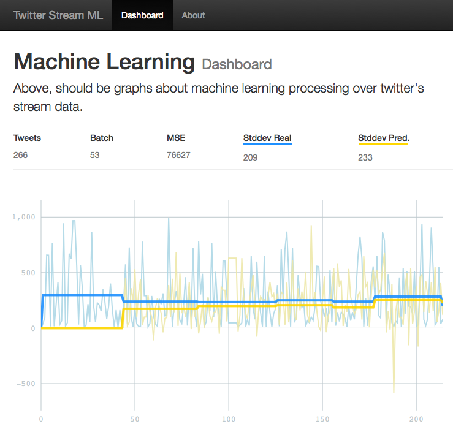

# twitter-stream-ml
Machine Learning over Twitter's stream. Using Apache Spark, Web Server and Lightning Graph server.


[](https://youtu.be/yxWWvbUFy9Q)

## 1. Building

This project are using [sbt](#sbt), [scala](#scala) and [java](#java).

```sh
$ sbt assembly
```

## 2. Pre-execution

### 2.1. Lightning Graph Server

First of all, the application depends on Lightning Graph Server.

The default server is http://public.lightning-viz.org, but you can [](https://heroku.com/deploy?template=https://github.com/lightning-viz/lightning/tree/v1.2.1) or [Install](#lightning) on your machine

### 2.2. Web Server

Second, the spark job (twtml-spark) depends on web server (twtml-web).

[](https://heroku.com/deploy?template=https://github.com/giorgioinf/twitter-stream-ml/tree/master) or run by command-line:

```sh
$ sbt web/run
or
$ scala web/target/scala-2.11/twtml-web*.jar
```

## 3. Command-line

It's possible to execute the spark job (twtml-spark) by command-line, without change
configuration files.

First of all, there are 3 ways to execute the application:

1. sbt
```sh
$ sbt "spark/run --master <master>"
```
2. standalone jar
```sh
$ scala -extdirs "$SPARK_HOME/lib" spark/target/scala-2.11/twtml-spark*.jar --master <master>
```
3. spark-submit
```sh
$ spark-submit --master <master> spark/target/scala-2.11/twtml-spark*.jar
```

Without master parameter, the default is local[2].

## 3.1. Help command

```sh
$ <command> --help
OR
$ <command> -h
```

## 4. Configuration
Just only spark job needs a configuration. It's also configurable by command-line.
You can see de command options running:

### 4.1. Twitter access tokens

```sh
$ <command> --consumerKey xxxxxxxxxxxxxxxxxxxxxxxxx \
--consumerSecret xxxxxxxxxxxxxxxxxxxxxxxxxxxxxxxxxxxxxxxxxxxxxxxxxx \
--accessToken xxxxxxxxxxxxxxxxxxxxxxxxxxxxxxxxxxxxxxxxxxxxxxxxxx \
--accessTokenSecret xxxxxxxxxxxxxxxxxxxxxxxxxxxxxxxxxxxxxxxxxxxxx
```

### 4.2. Servers

```sh
$ <command> --lightning http://localhost:3000 \
--twtweb http://localhost:8888
```

### 4.3. File configuration
If you prefer, you can use configuration file to save the same options available by command-line. It's necessary to create a &lt;application.conf&gt; file. You can also copy from &lt;reference.conf&gt;.

```sh
$ cp spark/src/main/resources/reference.conf \
/spark/src/main/resources/application.conf
```

Now, just change de application.conf

**spark/src/main/resources/application.conf**
```ini
...
lightning="http://localhost:3000"
twtweb="hhttp://localhost:8888"
consumerKey="xxxxxxxxxxxxxxxxxxxxxxxxx"
consumerSecret="xxxxxxxxxxxxxxxxxxxxxxxxxxxxxxxxxxxxxxxxxxxxxxxxxx"
accessToken="xxxxxxxxxxxxxxxxxxxxxxxxxxxxxxxxxxxxxxxxxxxxxxxxxx"
accessTokenSecret="xxxxxxxxxxxxxxxxxxxxxxxxxxxxxxxxxxxxxxxxxxxxx"
...
```

## Dependencies

### <a name="lightning"></a>[Lightning Graph Server](http://lightning-viz.org/) [](https://heroku.com/deploy?template=https://github.com/lightning-viz/lightning/tree/v1.2.1)

Lightning is a data-visualization server providing API-based access to reproducible, web-based, interactive visualizations.

### <a name="sbt"></a>[Simple Build Tool](http://www.scala-sbt.org) - 0.13.11

**sbt** is an open source build tool for Scala and Java projects, similar to Java's Maven or Ant.

### <a name="spark"></a>[Apache Spark](http://spark.apache.org) - 1.6.1

Apache Spark is an open-source cluster computing framework originally developed in the AMPLab at UC Berkeley. In contrast to Hadoop's two-stage disk-based MapReduce paradigm, Spark's in-memory primitives provide performance up to 100 times faster for certain applications. By allowing user programs to load data into a cluster's memory and query it repeatedly, Spark is well suited to machine learning algorithms.

### <a name="hadoop"></a>[Apache Hadoop](http://hadoop.apache.org) - 2.7.1

Apache Hadoop is an open-source software framework written in Java for distributed storage and distributed processing of very large data sets on computer clusters built from commodity hardware. All the modules in Hadoop are designed with a fundamental assumption that hardware failures are commonplace and thus should be automatically handled in software by the framework.

### <a name="scala"></a>[Scala](scala-lang.org) - 2.11.8

Scala is an object-functional programming language for general software applications. Scala has full support for functional programming and a very strong static type system. This allows programs written in Scala to be very concise and thus smaller in size than other general-purpose programming languages. Many of Scala's design decisions were inspired by criticism of the shortcomings of Java.

### <a name="java"></a>[Java Open JDK](http://openjdk.java.net) - Standard Edition - 1.7+

A general-purpose computer programming language designed to produce programs that will run on any computer system.

## Guides

- [Setting up Hadoop (v2) with Spark (v1) on OSX using Homebrew](http://datahugger.org/datascience/setting-up-hadoop-v2-with-spark-v1-on-osx-using-homebrew)
